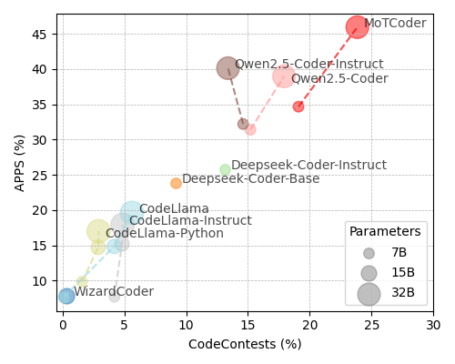

# MoTCoder: Elevating Large Language Models with Modular of Thought for Challenging Programming Tasks

<p align="center">
• 🤗 <a href="https://huggingface.co/datasets/JingyaoLi/MoTCode-Data" target="_blank">Data </a> • 🤗 <a href="https://huggingface.co/JingyaoLi/MoTCoder-15B-v1.0" target="_blank">Model </a> • 🐱 <a href="https://github.com/dvlab-research/MoTCoder" target="_blank">Code</a> • 📃 <a href="https://arxiv.org/abs/2312.15960" target="_blank">Paper</a> <br>
</p>

[](https://paperswithcode.com/sota/code-generation-on-apps?metric=Introductory%20Pass%401/motcoder-elevating-large-language-models-with) 
[](https://paperswithcode.com/sota/code-generation-on-codecontests?metric=Test%20Set%20pass%401)

Large Language Models (LLMs) have showcased impressive capabilities in handling straightforward programming tasks. However, their performance tends to falter when confronted with more challenging programming problems. We observe that conventional models often generate solutions as monolithic code blocks, restricting their effectiveness in tackling intricate questions. To overcome this limitation, we present Modular-of-Thought Coder (MoTCoder). We introduce a pioneering framework for MoT instruction tuning, designed to promote the decomposition of tasks into logical sub-tasks and sub-modules. 
Our investigations reveal that, through the cultivation and utilization of sub-modules, MoTCoder significantly improves both the modularity and correctness of the generated solutions, leading to substantial relative *pass@1* improvements of 12.9% on APPS and 9.43% on CodeContests.

## Performance




**Performance on APPS**

| Model                        | Size | Introductory | Interview | Competition | All   |
|------------------------------|------|--------------|-----------|-------------|-------|
| CodeT5                        | 770M | 6.60         | 1.03      | 0.30        | 2.00  |
| CodeRL+CodeT5                 | 770M | 7.08         | 1.86      | 0.75        | 2.69  |
| text-davinci-002              | -    | -            | -         | -           | 7.48  |
| Self-edit+text-davinci-002    | -    | -            | -         | -           | 7.94  |
| GPT-2                         | 0.1B | 5.64         | 6.93      | 4.37        | 6.16  |
|                               | 1.5B | 7.40         | 9.11      | 5.05        | 7.96  |
| GPT-Neo                       | 2.7B | 14.68        | 9.85      | 6.54        | 10.15 |
| GPT-3                         | 175B | 0.57         | 0.65      | 0.21        | 0.55  |
| StarCoder                     | 15B  | 7.25         | 6.89      | 4.08        | 6.40  |
| WizardCoder                   | 15B  | 26.04        | 4.21      | 0.81        | 7.90  |
| CodeChain+WizardCoder         | 15B  | 26.29        | 7.49      | 3.75        | 10.50 |
| Octocoder                     | 16B  | 16.50        | 7.92      | 4.61        | 8.97  |
| Codellama                     | 7B   | 14.15        | 6.63      | 4.00        | 7.61  |
|                               | 13B  | 23.94        | 13.50     | 9.80        | 14.85 |
|                               | 34B  | 32.01        | 18.61     | 10.19       | 19.61 |
| Codellama-Python              | 7B   | 18.83        | 8.62      | 4.47        | 9.83  |
|                               | 13B  | 26.40        | 13.44     | 6.86        | 14.72 |
|                               | 34B  | 26.45        | 16.61     | 8.77        | 17.01 |
| Codellama-Instruct            | 7B   | 14.20        | 6.63      | 4.43        | 7.70  |
|                               | 13B  | 22.41        | 14.34     | 6.62        | 15.21 |
|                               | 34B  | 28.64        | 16.80     | 10.51       | 17.91 |
| Deepseek-Coder-Base           | 6.7B | 40.23        | 22.12     | 13.04       | 23.92 |
| Deepseek-Coder-Instruct       | 6.7B | 44.65        | 23.86     | 12.89       | 25.83 |
| **MoTCoder**                  | 6.7B | **50.01**    | **29.81** | **14.36**   | **30.76** |
| GPT-4                         | -    | 34.97        | 13.75     | 14.52       | 18.15 |


**Performance on CodeContests**
| Model                     | Size | pass@1 | pass@5 |
|---------------------------|------|--------|--------|
| code-davinci-002           | -    | 1.00   | -      |
| code-davinci-002 + CodeT   | -    | 3.20   | -      |
| WizardCoder                | 15B  | 1.98   | 3.27   |
| WizardCoder + CodeChain    | 15B  | 2.48   | 3.30   |
| Octocoder                  | 16B  | 4.95   | 13.03  |
| Codellama                  | 7B   | 0.30   | 1.11   |
|                            | 13B  | 2.12   | 6.26   |
|                            | 34B  | 5.35   | 12.02  |
| Codellama-Python           | 7B   | 4.75   | 10.30  |
|                            | 13B  | 4.75   | 12.32  |
|                            | 34B  | 5.86   | 14.85  |
| Codellama-Instruct         | 7B   | 2.12   | 6.26   |
|                            | 13B  | 5.96   | 12.02  |
|                            | 34B  | 6.46   | 14.24  |
| Deepseek-Coder-Base        | 6.7B | 6.46   | 15.25  |
| Deepseek-Coder-Instruct    | 6.7B | 6.87   | 8.18   |
| **MoTCoder**               | 6.7B | **9.29** | **16.97** |
| GPT-4                      | -    | 16.36  | -      |

## Environment
Install the dependencies.
```bash
python -m pip install -e .
```

## Evaluation Datasets
### APPS Dataset
The APPs dataset [[github]](https://github.com/hendrycks/apps) can be download from [huggingface](https://huggingface.co/datasets/codeparrot/apps).

### CodeContests Dataset
The CodeContests dataset [[github]](https://github.com/google-deepmind/code_contests) can be download from [huggingface](https://huggingface.co/datasets/deepmind/code_contests).
For CodeContests, convert your dataset to the same format as APPs for utilizting APPs evaluation metrics:
```bash
python src/convert_codecontest_dataset.py $SRC_DIR $DST_DIR
```

## Inference
You can download our MoTCoder for evaluation from [huggingface](https://huggingface.co/JingyaoLi/MoTCoder-15B-v1.0). We provide the inference command to reproduce the results in our paper.
- If you want to use modular-of-thought inference prompt, set `prompt_type=FORMAT_PROMPT`.
- If you want to use normal inference prompt, set `prompt_type=NORMAL_FORMAT_PROMPT`.

First generate the solutions for you targeted evaluation dataset.
**Choice 1: VLLM (Recommended)**
To install the requreiments:
```bash
pip install vllm
```

Inference:
```bash
python src/inference_vllm.py \
    --model_path $model_path \
    --data_path $data_path \
    --solution_path $solution_path \
    --prompt_type $prompt_type
```

**Choice 2: transformers**
Inference:
```bash
python src/inference.py \
    $model_path \
    $data_path \
    $solution_path \
    $prompt_type
```
### APPs Evaluation
For APPs evaluation, choices of $level$ include $introductory, interview, competition$.
```bash
python src/test_leetcode.py \
    --solutions_path $solution_path \
    --data_path $data_path \
    --save_path $result_path \
    --level $level
```

### CodeContests Evaluation
```bash
python src/test_apps.py \
    --solutions_path $solution_path \
    --data_path $data_path \
    --save_path $result_path
```

## Training
### Modular-of-Thought Training Dataset
We provide an example python file to evolution a MoT dataset. 
Run the following command:
```bash
python src/generate_MoT_dataset.py \
    --data_path $data_path \
    --save_path $MoT_data_path \
    --api_base $api_base \
    --api_key $api_key
```

### MoTCode Dataset
Or, you can download our generated modular-of-thought code dataset.
```python
from datasets import load_dataset
load_dataset("JingyaoLi/MoTCode-Data")
```

### Modular-of-Thought Training
Run the following command to train the model 
```bash 
deepspeed src/train.py \
    --model_name_or_path $model_path \
    --data_path $MoT_data_path \
    --output_dir $output_dir \
    --num_train_epochs 3 \
    --model_max_length 2048 \
    --per_device_train_batch_size 8 \
    --per_device_eval_batch_size 1 \
    --gradient_accumulation_steps 1 \
    --evaluation_strategy "no" \
    --save_strategy "steps" \
    --save_steps 1000 \
    --save_total_limit 3 \
    --learning_rate 2e-5 \
    --warmup_steps 30 \
    --logging_steps 2 \
    --lr_scheduler_type "cosine" \
    --report_to "tensorboard" \
    --gradient_checkpointing True \
    --deepspeed configs/deepspeed_config.json \
    --fp16 True \
    --prompt_type FORMAT_PROMPT
```
