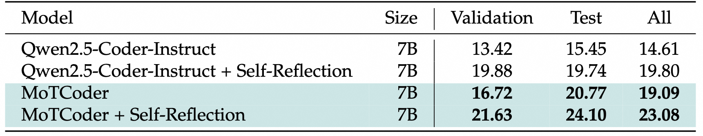

# MoTCoder: Elevating Large Language Models with Modular of Thought for Challenging Programming Tasks

<p align="center">
• 🤗 <a href="https://huggingface.co/datasets/JingyaoLi/MoT-Code-350K" target="_blank">Data </a> • 🤗 <a href="https://huggingface.co/JingyaoLi/MoTCoder-7B-v1.5" target="_blank">Model </a> • 🐱 <a href="https://github.com/dvlab-research/MoTCoder" target="_blank">Code</a> • 📃 <a href="https://arxiv.org/abs/2312.15960" target="_blank">Paper</a> <br>
</p>

[](https://paperswithcode.com/sota/code-generation-on-apps?metric=Introductory%20Pass%401/motcoder-elevating-large-language-models-with) 
[](https://paperswithcode.com/sota/code-generation-on-codecontests?metric=Test%20Set%20pass%401)

Large Language Models (LLMs) have showcased impressive capabilities in handling straightforward programming tasks. However, their performance tends to falter when confronted with more challenging programming problems. We observe that conventional models often generate solutions as monolithic code blocks, restricting their effectiveness in tackling intricate questions. To overcome this limitation, we present Module-of-Thought Coder (MoTCoder). We introduce a framework for MoT instruction tuning, designed to promote the decomposition of tasks into logical sub-tasks and sub-modules. Our investigations reveal that, through the cultivation and utilization of sub-modules, MoTCoder significantly improves both the modularity and correctness of the generated solutions, leading to substantial pass@1 improvements of 5.9% on APPS and 5.8% on CodeContests. MoTCoder also achieved significant improvements in self-correction capabilities, surpassing the current SOTA by 3.3%. Additionally, we provide an analysis of between problem complexity and optimal module decomposition and evaluate the maintainability index, confirming that the code generated by MoTCoder is easier to understand and modify, which can be beneficial for long-term code maintenance and evolution. Our codes are available at https://github.com/dvlab-research/MoTCoder.

<div style="text-align: center;">
    
</div>

## Performance

### APPS
<div style="text-align: center;">
    
</div>

### CodeContests
<div style="text-align: center;">
    
</div>

### Reflection
<div style="text-align: center;">
    
</div>


## Evaluation

### Environment 
To set up the environment, run:
```bash
pip install -e eval/requirements.txt
```

### Model Preparation
Download [MoTCoder-7B-v1.5](https://huggingface.co/JingyaoLi/MoTCoder-7B-v1.5) and organize the files as follows:
```
- models 
    - MoTCoder-7B-v1.5
```

### Data Preparation
1. Download the datasets [APPS](https://huggingface.co/datasets/codeparrot/apps) and [codecontests](https://huggingface.co/datasets/deepmind/code_contests), then structure your directories like this:
```
- data 
    - apps
    - code_contests
```
2. Run the following script to prepare the test data:
```bash
python eval/dataset/data.py
```

### Run Evaluation
Execute the scripts below to perform the evaluation:
```bash
# For APPS and CodeContests datasets
bash eval/scripts/eval_motcoder_apps_codecontests.sh

# For Fix
bash eval/scripts/eval_motcoder_fix.sh
```

## Training

### Environment 
We use [LLaMAFactory](https://github.com/hiyouga/LLaMA-Factory) to train our model. Set up the environment with:
```bash
git clone --depth 1 https://github.com/hiyouga/LLaMA-Factory.git
cd LLaMA-Factory
pip install -e ".[torch,metrics]"
```

### Data Preparation
Add the following entry to `LLaMA-Factory/data/dataset_info.json`:
```json
"motcode": {
    "hf_hub_url": "JingyaoLi/MoT-Code-350K"
}
```

### Run Training
Navigate to the LLaMA-Factory directory and use the following commands to start training:
```bash
cd LLaMA-Factory
# For multi-GPU
llamafactory-cli train train/configs/MoTCoder-7B-Instruct-sft-2e-06-mot.yaml
# For single-GPU
FORCE_TORCHRUN=1 llamafactory-cli train train/configs/MoTCoder-7B-Instruct-sft-2e-06-mot.yaml
```

## Citation 
If you find our work useful, please consider citing it.
```
@misc{li2025motcoderelevatinglargelanguage,
      title={MoTCoder: Elevating Large Language Models with Modular of Thought for Challenging Programming Tasks}, 
      author={Jingyao Li and Pengguang Chen and Bin Xia and Hong Xu and Jiaya Jia},
      year={2025},
      eprint={2312.15960},
      archivePrefix={arXiv},
      primaryClass={cs.LG},
      url={https://arxiv.org/abs/2312.15960}, 
}
```
